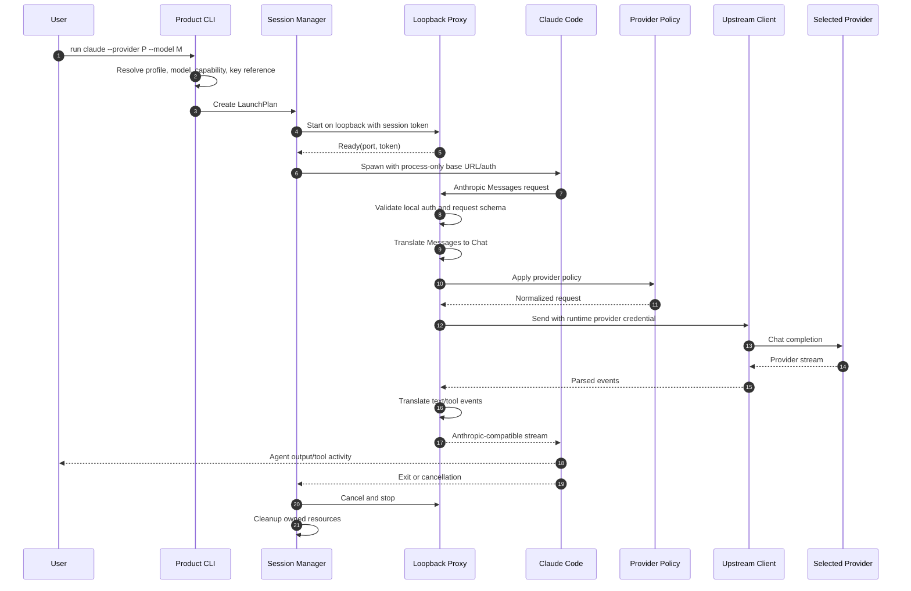

# Claude Code Sequence

```mermaid
sequenceDiagram
    autonumber
    participant U as User
    participant CLI as Product CLI
    participant SM as Session Manager
    participant PX as Loopback Proxy
    participant CC as Claude Code
    participant PP as Provider Policy
    participant UP as Upstream Client
    participant PR as Selected Provider

    U->>CLI: run claude --provider P --model M
    CLI->>CLI: Resolve profile, model, capability, key reference
    CLI->>SM: Create LaunchPlan
    SM->>PX: Start on loopback with session token
    PX-->>SM: Ready(port, token)
    SM->>CC: Spawn with process-only base URL/auth
    CC->>PX: Anthropic Messages request
    PX->>PX: Validate local auth and request schema
    PX->>PX: Translate Messages to Chat
    PX->>PP: Apply provider policy
    PP-->>PX: Normalized request
    PX->>UP: Send with runtime provider credential
    UP->>PR: Chat completion
    PR-->>UP: Provider stream
    UP-->>PX: Parsed events
    PX->>PX: Translate text/tool events
    PX-->>CC: Anthropic-compatible stream
    CC-->>U: Agent output/tool activity
    CC-->>SM: Exit or cancellation
    SM->>PX: Cancel and stop
    SM->>SM: Cleanup owned resources
```

Failure boundaries include credential resolution, proxy start, harness start, translation, provider auth/rate/context errors, malformed streams, and cleanup.
