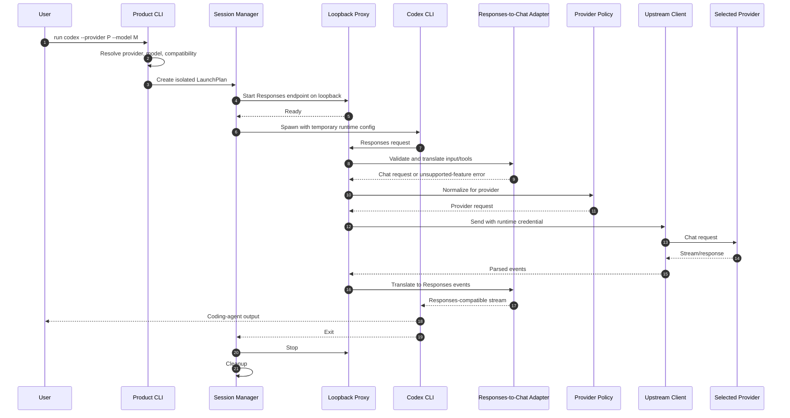

# Codex Sequence

```mermaid
sequenceDiagram
    autonumber
    participant U as User
    participant CLI as Product CLI
    participant SM as Session Manager
    participant PX as Loopback Proxy
    participant CX as Codex CLI
    participant PA as Responses-to-Chat Adapter
    participant PP as Provider Policy
    participant UP as Upstream Client
    participant PR as Selected Provider

    U->>CLI: run codex --provider P --model M
    CLI->>CLI: Resolve provider, model, compatibility
    CLI->>SM: Create isolated LaunchPlan
    SM->>PX: Start Responses endpoint on loopback
    PX-->>SM: Ready
    SM->>CX: Spawn with temporary runtime config
    CX->>PX: Responses request
    PX->>PA: Validate and translate input/tools
    PA-->>PX: Chat request or unsupported-feature error
    PX->>PP: Normalize for provider
    PP-->>PX: Provider request
    PX->>UP: Send with runtime credential
    UP->>PR: Chat request
    PR-->>UP: Stream/response
    UP-->>PX: Parsed events
    PX->>PA: Translate to Responses events
    PA-->>CX: Responses-compatible stream
    CX-->>U: Coding-agent output
    CX-->>SM: Exit
    SM->>PX: Stop
    SM->>SM: Cleanup
```

Responses-only features that materially affect behavior must not be silently discarded.
