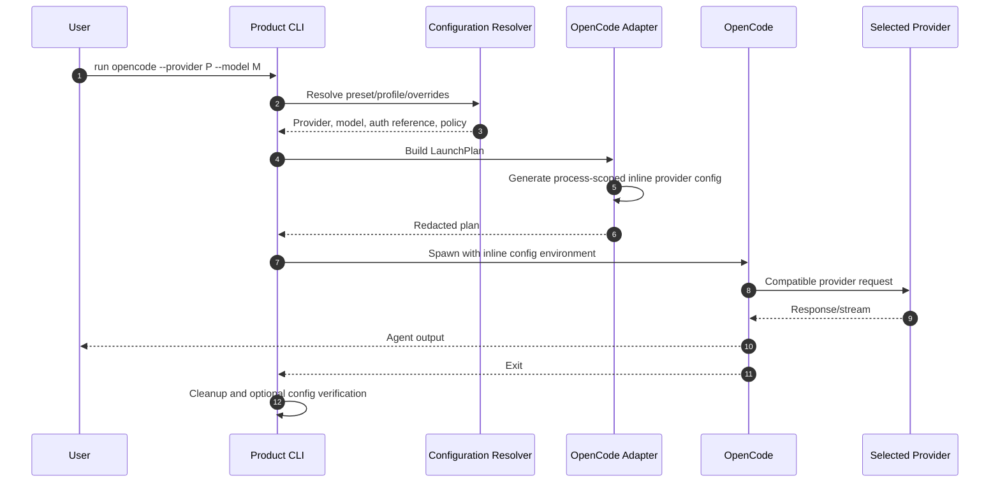

# OpenCode Sequence

Expected product effects:

- no write to normal OpenCode provider config;
- no plaintext key written to disk;
- saved profile may contain only the key environment-variable name.
