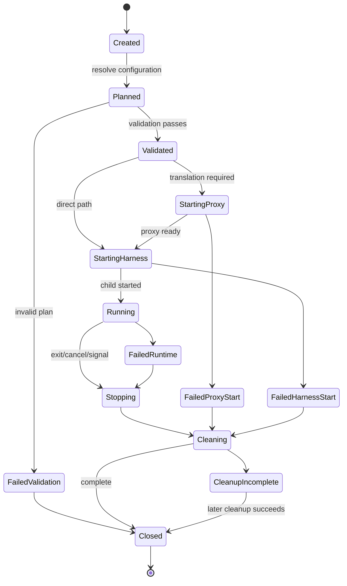
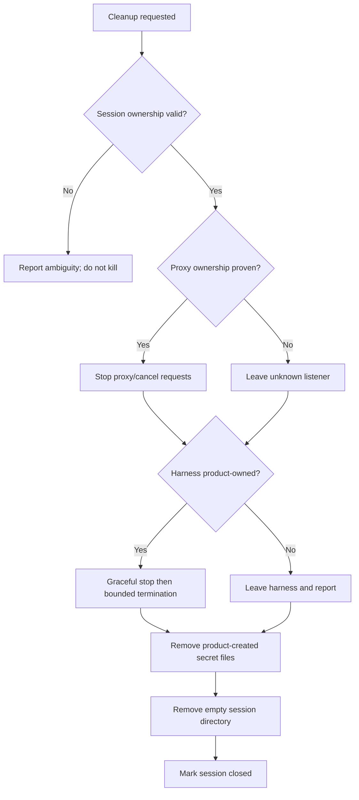

# Session Lifecycle and Cleanup

```mermaid
stateDiagram-v2
    [*] --> Created
    Created --> Planned: resolve configuration
    Planned --> Validated: validation passes
    Planned --> FailedValidation: invalid plan
    Validated --> StartingProxy: translation required
    Validated --> StartingHarness: direct path
    StartingProxy --> StartingHarness: proxy ready
    StartingProxy --> FailedProxyStart
    StartingHarness --> Running: child started
    StartingHarness --> FailedHarnessStart
    Running --> Stopping: exit/cancel/signal
    Running --> FailedRuntime
    FailedRuntime --> Stopping
    Stopping --> Cleaning
    FailedProxyStart --> Cleaning
    FailedHarnessStart --> Cleaning
    FailedValidation --> Closed
    Cleaning --> Closed: complete
    Cleaning --> CleanupIncomplete
    CleanupIncomplete --> Closed: later cleanup succeeds
    Closed --> [*]
```

```mermaid
flowchart TD
    C[Cleanup requested] --> A{Session ownership valid?}
    A -- No --> R[Report ambiguity; do not kill]
    A -- Yes --> P{Proxy ownership proven?}
    P -- Yes --> SP[Stop proxy/cancel requests]
    P -- No --> NP[Leave unknown listener]
    SP --> H{Harness product-owned?}
    NP --> H
    H -- Yes --> SH[Graceful stop then bounded termination]
    H -- No --> LH[Leave harness and report]
    SH --> F[Remove product-created secret files]
    LH --> F
    F --> D[Remove empty session directory]
    D --> M[Mark session closed]
```

Cleanup is idempotent and never kills a process solely by executable name, PID from stale metadata, or port.
