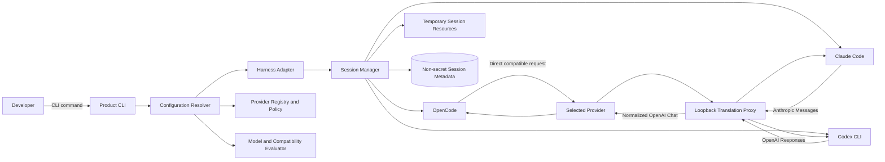
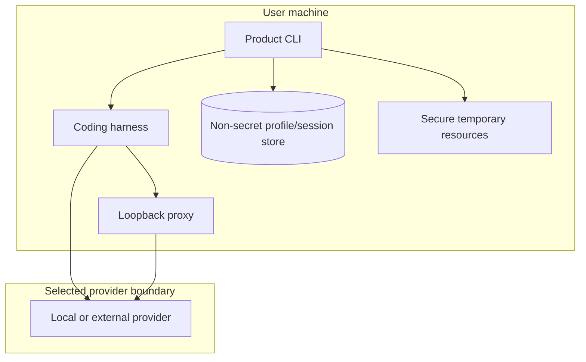

# System Context Diagram

## Trust boundaries

Key rules:

- provider is explicitly selected;
- secrets are runtime-only by default;
- proxies bind to loopback;
- compatibility is evaluated before launch;
- supported paths preserve persistent harness configuration.
