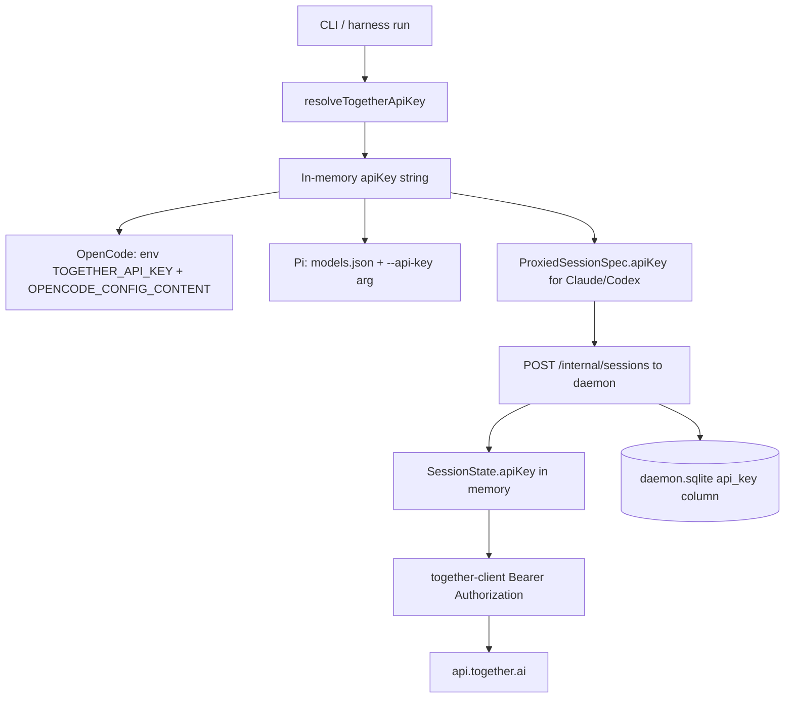

# Credential data flow

## Sources (precedence)

From `resolveTogetherApiKey` in `together-core.ts`:

```text
1. explicit --api-key flag          (literal secret; discouraged)
2. ~/.togetherlink/config.json      (literal or "{env:TOGETHER_API_KEY}")
3. process.env.TOGETHER_API_KEY
```

`configure` writes either a literal key or the env reference via `global-config.ts`.

## Resolution → use



## Per-harness paths

### OpenCode (spawned, direct)

1. Resolve key.
2. Build inline config with `options.apiKey = "{env:TOGETHER_API_KEY}"` (not literal in config JSON).
3. Spawn `opencode` with `TOGETHER_API_KEY=<secret>` and `OPENCODE_CONFIG_CONTENT`.
4. OpenCode uses `@ai-sdk/togetherai` → Together directly.
5. **No daemon registration of the key** for OpenCode path (daemon not used).

### Claude (proxied)

1. Resolve key.
2. `runProxiedSession` → `ensureDaemon` → `registerDaemonSession({ apiKey, authToken, model… })`.
3. Spawn `claude` with `ANTHROPIC_BASE_URL=http://127.0.0.1:<port>/…` and `ANTHROPIC_AUTH_TOKEN=<local token>` (not Together key).
4. Daemon authenticates local requests with session/local token.
5. Daemon calls Together with stored session `apiKey`.

### Codex (proxied)

Same as Claude, but:

- Responses wire API to loopback.
- Local token via `CODEX_AUTH_ENV` / provider `env_key`.
- Temp model catalog JSON on disk (non-secret models).

### Pi (spawned)

1. Resolve key.
2. Write temp `models.json` **containing the literal apiKey**.
3. Pass `--api-key` on the command line (visible in process list).
4. Cleanup temp dir after exit (intended).

## Local proxy token

- File: under `~/.togetherlink/` (`local-proxy-token` via daemon launch helpers).
- Also stored as `auth_token` in SQLite for active sessions.
- Distinct from Together API key; still sensitive (allows using that session’s upstream key).

## Leak surfaces (ordered by severity)

| Surface                        | Secret                     | Severity                | Plan ref                     |
| ------------------------------ | -------------------------- | ----------------------- | ---------------------------- |
| `daemon.sqlite` `api_key`      | Together key               | **High**                | M2 / ADR-0005                |
| `daemon.sqlite` `auth_token`   | Local proxy token          | High                    | M2                           |
| `config.json` literal `apiKey` | Together key               | High if used            | Prefer env ref only          |
| Pi `models.json` + argv        | Together key               | Medium                  | Avoid file/argv secrets      |
| `--api-key` flag               | Together key               | Medium                  | History / `ps`               |
| Process env of child           | Together or local token    | Expected session-scoped | Clear on exit                |
| Logs / debug                   | Possible                   | Medium                  | Redaction (exists partially) |
| Telemetry                      | Should not include secrets | Verify                  | keep canaries                |

## Target state (product REQUIREMENTS)

- Profiles store **env var names**, not values.
- Active session keys **memory-only**.
- No plaintext keys in SQLite.
- After daemon restart: sessions stale; user re-runs (no transparent secret resume).
