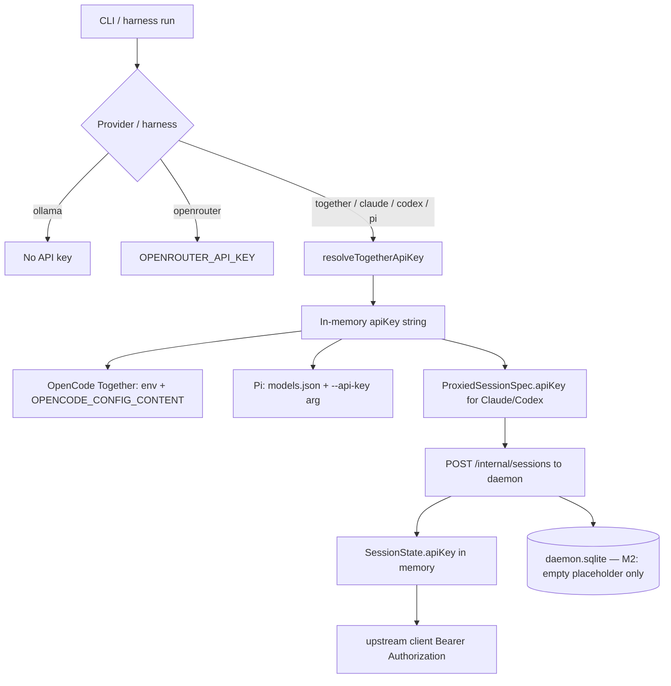

# Credential data flow

## Product rule (current)

**Credentials are required only for the selected provider at launch time.**

- There is **no** product-level Together API key gate on CLI start, interactive menu, or OpenCode/Ollama.
- Together is an **optional preset** (still used by Claude/Codex/Pi until M5–M6).
- OpenCode **defaults to Ollama** (no API key).
- OpenRouter uses `OPENROUTER_API_KEY` (or configure store) only when `--provider openrouter`.

## Sources by provider

### Together preset (`resolveTogetherApiKey`)

```text
1. explicit --api-key flag
2. ~/.togetherlink/config.json → apiKey (literal or "{env:TOGETHER_API_KEY}")
3. process.env.TOGETHER_API_KEY
```

Used by: Claude, Codex, Pi, codex-app/ChatGPT Desktop, OpenCode `--provider together`.

### OpenRouter preset

```text
1. explicit --api-key flag
2. process.env.OPENROUTER_API_KEY
3. ~/.togetherlink/config.json → openrouterApiKey (literal or "{env:OPENROUTER_API_KEY}")
```

Used by: OpenCode `--provider openrouter`.

### Ollama preset

No API key. Optional `--base-url` only.

### Exa (optional web search)

```text
1. process.env.EXA_API_KEY
2. ~/.togetherlink/config.json → exaApiKey
```

Not required for launch. Used by Claude proxy web_search when set.

## Resolution → use (Together path only)



## Per-harness paths

### OpenCode (spawned, direct) — multi-provider

1. Default provider: **ollama** (no key).
2. Build session-only `OPENCODE_CONFIG_CONTENT` (never writes `~/.config/opencode`).
3. Provider-specific env only when needed (`TOGETHER_API_KEY` / `OPENROUTER_API_KEY`).
4. No daemon for OpenCode path.

### Claude / Codex (proxied) — Together preset today

1. Resolve Together key; clear error if missing (points users to Ollama OpenCode).
2. `runProxiedSession` → register session with daemon (key memory-only; SQLite redacted M2).
3. Spawn harness against loopback with local auth token (not upstream key).

### Pi (spawned) — Together preset today

1. Resolve Together key.
2. Temp `models.json` may still contain apiKey (tracked hardening).
3. Cleanup after exit.

## Local proxy token

- File under product home (`local-proxy-token`).
- Distinct from provider API keys; session-scoped loopback auth.

## Leak surfaces (ordered by severity)

| Surface                                  | Secret           | Severity     | Status                |
| ---------------------------------------- | ---------------- | ------------ | --------------------- |
| `daemon.sqlite` `api_key` / `auth_token` | upstream / local | High         | **M2: not written**   |
| `config.json` literal keys               | provider keys    | High if used | Prefer `{env:…}` refs |
| Pi `models.json` + argv                  | Together key     | Medium       | Hardening backlog     |
| `--api-key` flag                         | any provider     | Medium       | History / `ps`        |
| Process env of child                     | session-scoped   | Expected     | Cleared on exit       |

## Target state (product REQUIREMENTS)

- Profiles store **env var names**, not values, when possible.
- Active session keys **memory-only**.
- No plaintext keys in SQLite.
- After daemon restart: sessions sealed; no transparent secret resume.
- **No cloud key required** to use the product (OpenCode + Ollama).
